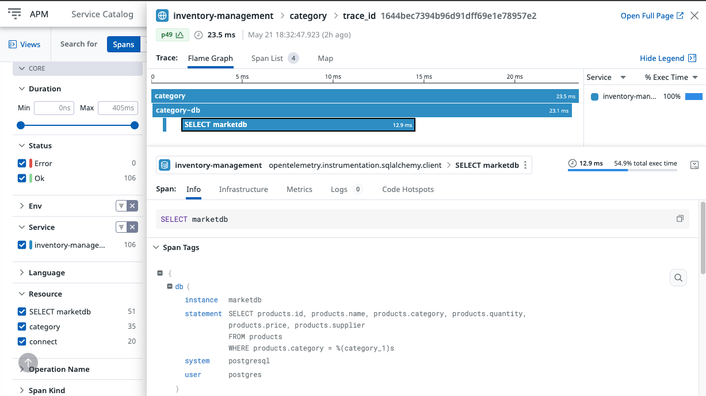
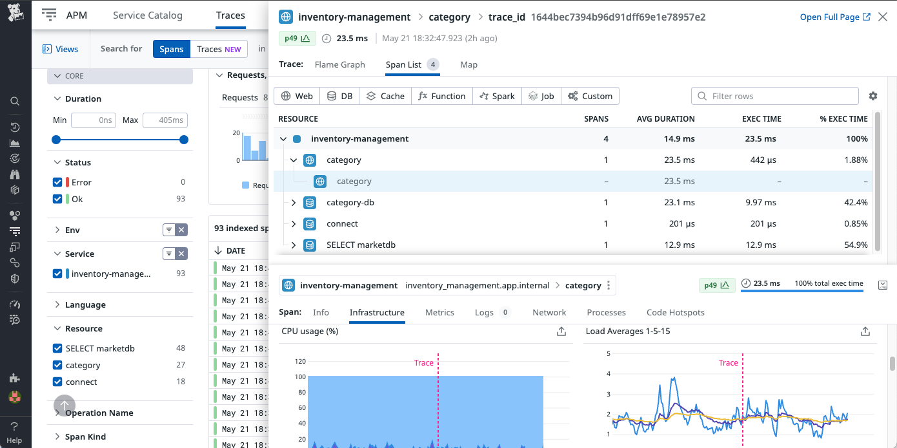

# Datadog OTel Traces

## Outcomes Performed by the OTel Libraries in Datadog

* Proper representation of the manually instrumented functions

* Breakdown of each manually instrumented resource

* Visual Map only presented the single service (unlike Jaeger) 
