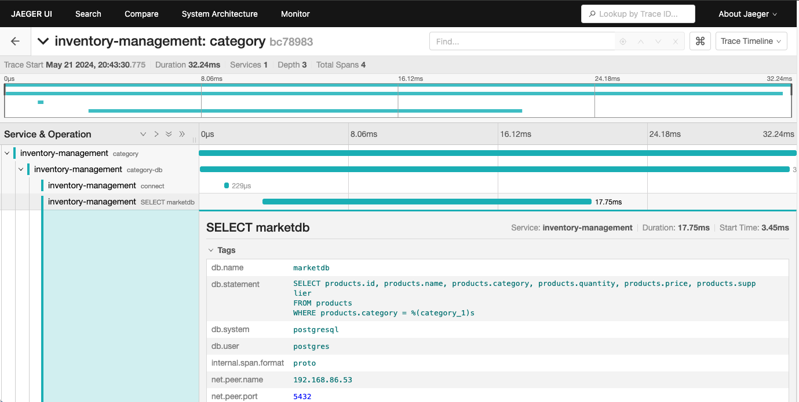
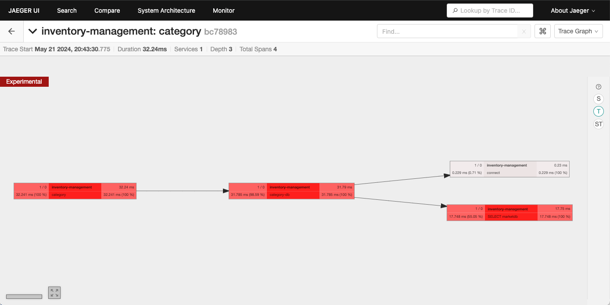
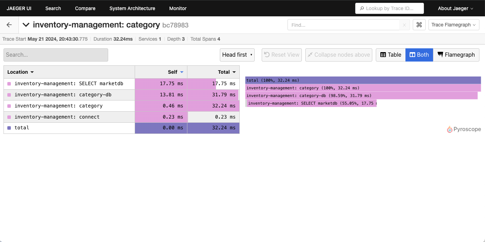

# OTel Traces Shipped to Jaeger

## Outcomes Performed by OpenTelemetry Manual Instrumentation

* APM OpenTelemetry Trace + Discovery of SQL transaction with SQLAlchemy shipped to Jaeger
  * `SQLAlchemyInstrumentor().instrument(engine=engine, enable_commenter=True, commenter_options={"db_driver": True})`

* Proper mapping of the manually instrumented functions

* Flamegraph stats for execution time

