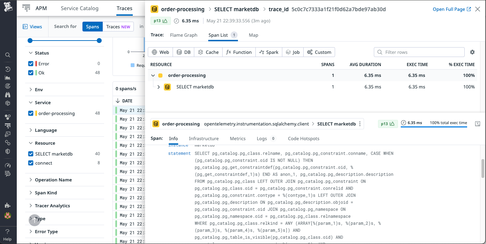
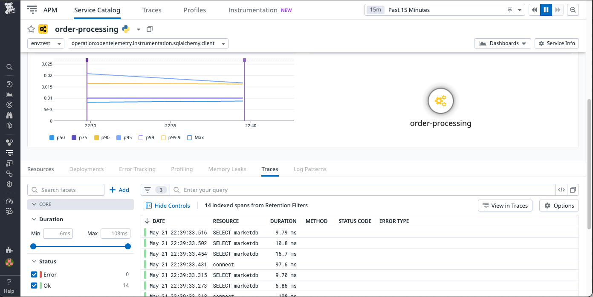

## Auto Instrumentation Sent to Datadog

* Two spans were auto discovered (connect + SELECT marketdb)
* The transaction query was not discovered containing (might need additional configs?)
```sql
SELECT products.id,
  products.name,
  products.category,
  products.quantity,
  products.price,
  products.supplier
FROM products
  WHERE products.supplier = ?
```




